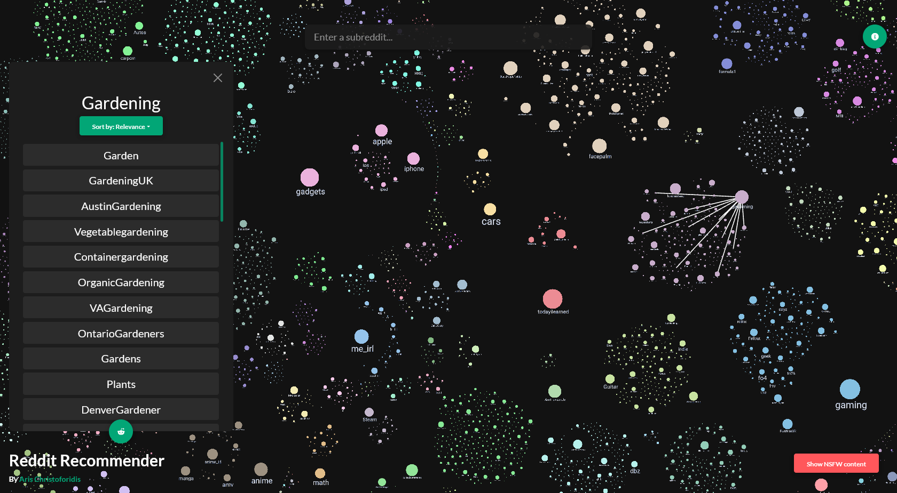

# [Reddit Recommender](https://arischristoforidis.github.io/reddit-recommender/)

## Introduction

[Reddit Recommender](https://arischristoforidis.github.io/reddit-recommender/) is a tool to discover new subreddits. To use it, you can either enter a subreddit name in the search bar or click on a node in the graph. A list of similar subreddits will appear on the sidebar. Clicking any of the recommended subreddits will open it on a new tab. Using the button at the bottom of the sidebar will create a multi reddit with all the subreddits in the list. 

NSFW subreddits are hidden by default, but can be toggled using the "Show NSFW content" button.

## How it works

### Generating subreddit relationships
The algorithm uses a content based approach to correlate subreddits. For this step, I used post data from June 2021 to May 2022 from [Pushshift](https://files.pushshift.io/reddit/).

1. Get the top posts for each subreddit.
2. Feed the post titles through the [all-MiniLM-L6-v2](https://huggingface.co/sentence-transformers/all-MiniLM-L6-v2) sentence transformer to get a vector embedding for each post. The model used produces 384 dimensional embeddings.
3. Calculate each subreddit's vector embedding by performing weighted average on its posts' embeddings. For the weight of each post embedding we use the karma score. This results in an embedding vector that represents the subreddit's subject matter.
4. Calculate the weight of a connection between 2 subreddits using cosine distance. *(Note: Smaller distance &rarr; Larger weight)*
5. Keep the top connections on each subreddit. Additionally, discard connections below a certain threshold.

### Visualization
The full graph contains more than 132K subreddits, but we can only visualize about 40-50K nodes without hindering performance. I extracted the top 45K subreddits into a separate graph, and imported it into Gephi. I used the [Leiden](https://arxiv.org/abs/1810.08473) community detection algorithm to form clusters and the Circle Pack layout to position them.

On the front end, I used the `ngraph` package along `w-gl` to visualize my results.

## Discussion
- This project was initially inspired by Andrei Kashcha's [Map of Reddit](https://anvaka.github.io/map-of-reddit/). I wanted to explore the effectiveness of sentence transformers, so I decided to adopt an ML approach to solve the problem of creating the subreddit graph. My content based technique seems to provide solid subreddit recommendations even on large subreddits, which is harder to do using a user overlap based approach (mainly due to reddit's old default subreddit policy).
- One peculiarity of my approach is that the algorithm often creates strong connections between subreddits of vastly different sizes. This may or may not be welcome. For this reason, I have added the ability to provide recommendations by taking into account the size of each related subreddit, prioritizing connections with more popular subreddits.
- Clustering can be performed in a number of ways. I chose to use the Leiden algorithm because it is very fast, it provides very good results, and doesn't require the number of clusters as input.
- I decided to remove any connections between the SFW and NSFW subreddits that may be created by the algorithm. The SFW and NSFW are completely disjoint.

## Acknowledgments

- Thanks to [Andrei Kashcha](https://github.com/anvaka) for providing the initial inspiration with his project, and also for providing his graph drawing packages along with a starter project.
- Thanks to [Jason Michael Baumgartner](https://github.com/pushshift) for collecting and providing the reddit post data.
- Thanks to my friends [Xhino Mullaymeri](https://github.com/XhinoMullaymeri) and [Nick Pantelidis](https://github.com/Thunderarea) for testing the website.

#### Final Note
This was my first time writing Javascript so I probably messed a few things up. However, I am pretty happy with how the website turned out :)

## Licence
MIT

